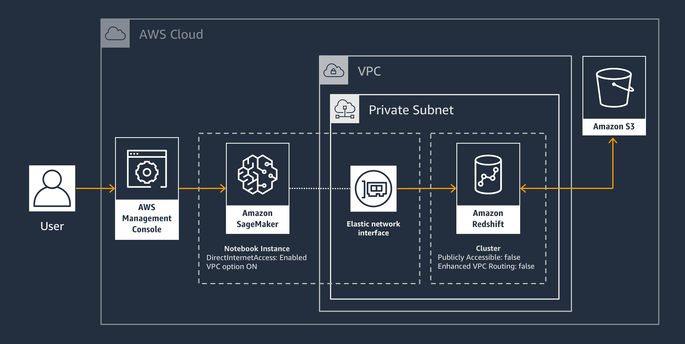

aws-sagemaker-redshift
---
Tokyo Region | `ap-northeast-1`

[](https://console.aws.amazon.com/cloudformation/home?region=ap-northeast-1#/stacks/new?stackName=SageMakerRedshift&templateURL=https://s3.amazonaws.com/midaisuk-public-templates/sagemaker-redshift/master.yaml
) 

# Architecture



# Deploy
1. Create a CloudFormation Stack 
2. Open Jupyter Notebook in the SageMaker notebook instance 
3. Execute commands and play with the [sample data](https://docs.aws.amazon.com/ja_jp/redshift/latest/gsg/rs-gsg-create-sample-db.html) 


## Parameters

# Get Credential

https://docs.aws.amazon.com/ja_jp/redshift/latest/mgmt/generating-iam-credentials-cli-api.html

```
aws redshift get-cluster-credentials --cluster-identifier sagemakerredshift-redshiftcluster-XXXXXXX --db-user tmp_user --db-name dev --duration-seconds 3600
```
